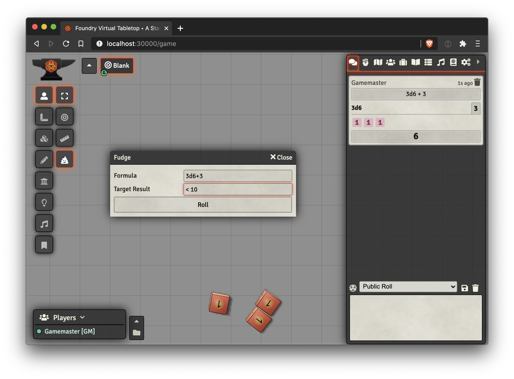

# Foundry VTT: Fudge

Fudge your dice rolls! Adds a new dice roll tool to the tokens toolbar. Click the 💩 button, enter in a dice roll formula (like `1d20+3+2`), enter in your desired result (like `< 10`), and voilà! Your dice have been secretly rolled a bunch of times in the background ensuring only your desired result is shown to the players.

## Installation

Install directly from within [Foundry VTT's package browser](https://foundryvtt.com/packages/fudge/):

https://foundryvtt.com/packages/fudge/

Or, install manually with [this Manifest URL](https://raw.githubusercontent.com/troygoode/fvtt-fudge/main/module.json):

```
https://raw.githubusercontent.com/troygoode/fvtt-fudge/main/module.json
```

## Demos



## License

This module is available as open source under the terms of the MIT License.

[MIT License](http://www.opensource.org/licenses/mit-license.php)
